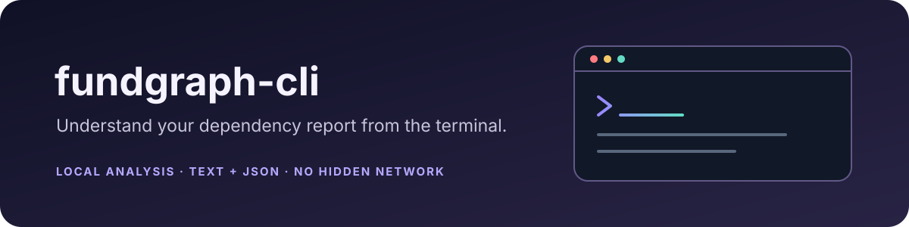

<p align="center"></p>

<p align="center">
  <a href="LICENSE"></a>
  
  
</p>

# fundgraph-cli

The command-line interface for local dependency discovery and deterministic text or JSON reports. It uses
`@fundgraph/core` for models and analysis; it does not duplicate domain logic.

## Current scope

`fundgraph analyze` reads a supported project directory, a JSON model file, or JSON from stdin. Directory discovery
supports npm, PyPI, Cargo, and baseline Go `go.mod` requirements. The command runs locally and does not make hidden
network requests.

The core library also has recorded metadata/funding parsers and relationship APIs, but the CLI does not yet orchestrate
those stages for arbitrary projects. Funding analysis is therefore not part of the current directory command output.

## Commands

```text
fundgraph --help
fundgraph version
fundgraph analyze [PATH] [--format text|json] [--offline] [--strict]
```

`PATH` defaults to the current directory. Use `-` or omit the path to read JSON from stdin. `--offline` makes the local
only behavior explicit. `--strict` treats invalid model input as an error.

| Exit code | Meaning |
|---:|---|
| `0` | Analysis completed without diagnostics |
| `1` | Partial analysis or model diagnostics |
| `2` | Usage or invalid input |
| `3` | Unexpected internal failure |

JSON output keeps the compatibility summary fields and includes the versioned core report under `report`. Text output
prints the summary and deterministic report.

## Try it from the workspace

The CLI package is not published yet. Run these commands from the `fundgraph-cli` repository directory:

```sh
cd ../fundgraph-core
npm ci
npm run build

cd ../fundgraph-cli
npm install --ignore-scripts --no-save ../fundgraph-core
npm run build
node dist/main.js --help
node dist/main.js analyze ../fundgraph-core/test/fixtures/npm-workspace --format text --offline
node dist/main.js analyze ../fundgraph-core/test/fixtures/npm-workspace --format json --offline
```

After compatible npm packages are published, install and run it with:

```sh
npm install -g fundgraph
fundgraph analyze ./my-project --format text --offline
```

## Ownership and safety

- This repository owns argument parsing, terminal output, CLI errors, and process exit codes.
- `fundgraph-core` owns dependency models, parsing, evidence, and relationship logic.
- Input files are bounded and treated as data; the CLI does not execute project code.
- The command does not identify maintainers, endorse funding destinations, manage wallets, or execute payments.

## Development

```sh
npm run lint
npm run typecheck
npm test
npm run build
npm pack --dry-run
```

CI defines Ubuntu, Windows, and macOS jobs on Node 20 and 22. See [`CONTRIBUTING.md`](CONTRIBUTING.md) and the
project-level `fundgraph` repository for the cross-repository roadmap and policies.
